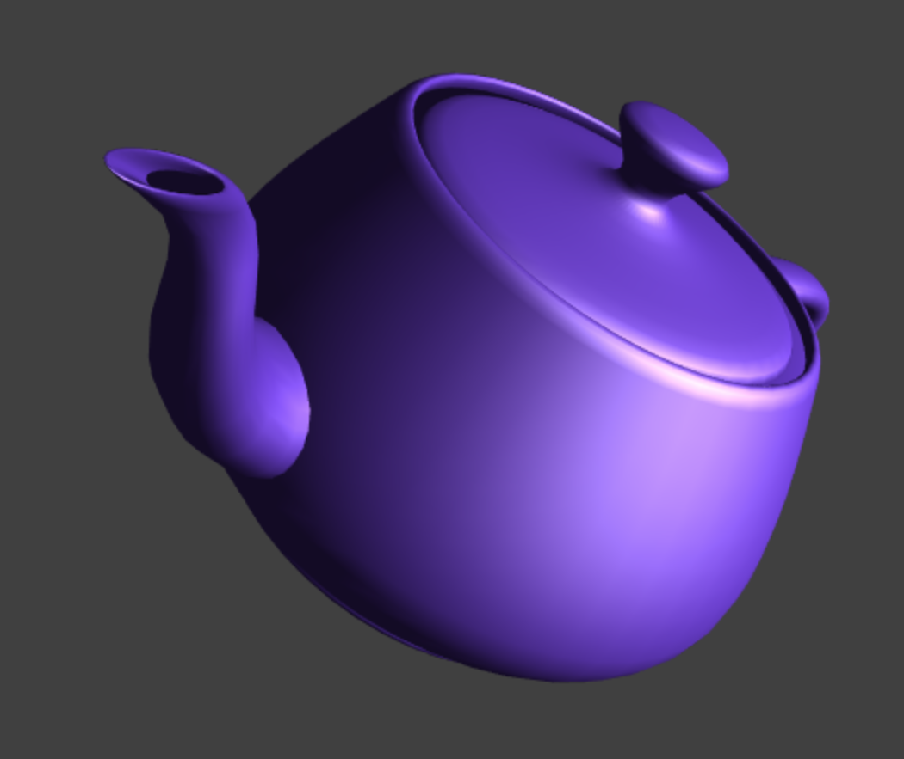

This is a simple example of using [WebGL](https://www.khronos.org/webgl/) to draw geometry which is generated in Rust.

WebGL-Teapot demo © 2020 RustyTriangles LLC

## Building

First build the Rust code like this:

    wasm-pack build

Then build the Javascript like this:

    cd www
    npm install
    npm run start

### Modules used
* [wasm-pack](https://crates.io/crates/wasm-pack) Tool that compiles Rust to Wasm.
* [wasm-bindgen](https://crates.io/crates/wasm-bindgen) Creates bindings between the two languages.
* [webpack](https://www.npmjs.com/package/webpack) Module bundler.
* [gl-matrix](http://glmatrix.net/) Handy utilities for matrix & vector
